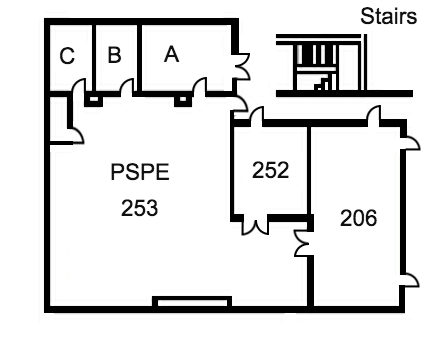

# Laboratory Safety Manual
###### for the
### Program for Semiconductor Product Engineering
#### November 2017

In accordance with the requirements of Section 11 of the Texas Tech University Chemical Hygiene Plan dated April 2015

# Table of Contents

Section | Content | Page Number
---|---|---
1 | Emergency Guidance Information | 4
 | Emergency Contact Information | 5-6
 | Emergency Response Equipment Location | 7
 | General Emergency Guidance | 8
 | Medical Emergency Guidance | 9
 | Fire Emergency Guidance | 10
 | Electrocution Emergency Guidance | 11
 | Active Shooter Emergency Guidance | 12
 | Tornado Emergency Guidance | 13
2 | General Information and Policies | 14
 | Guidance Statement | 15
 | Minimum Training Required | 16
 | Hazard Identification | 17
 | Location of Laboratory/Workspace Documents | 18
 | Minimum PPE required | 19
 | Responsible Personnel | 20
 3 | Laboratory Operating Procedures | 21
 | General Safety Requirements | 22
 | Facility Safety Requirements | 23
 | Incident Reporting Procedure | 24
 4 | Equipment Operating Procedures | 25
 | General Equipment Requirements | 26-30
 5 | Important References | 31
  | Section 5 | 32-37
  | Section 11 | 38-39

# Emergency Contact Information and Guidance

### Emergency Contact Information

###### TTU Police (UPD)
>	Emergency – __*9-911*__  
>	Non-Emergency – __*742-3931*__

###### TTU Environmental Health and Safety (EH&S)
>	Daytime Emergencies (M-F, 8:00 AM – 5:00 PM) – __*742-2876*__  
>	Non-Daytime Emergencies (24 hrs/day, 7 days/week) – __*742-3328*__

###### TTU Emergency Maintenance
>	Any Time – __*742-3324*__

###### AFTER emergency is reported, contact:

Responsible Principle Investigator or Supervisor: | Richard Gale
--- | ----
Office Number: | ECE 236
Primary: | (806) 535-9576
Office Phone: | (806) 834-0007
Email: | richard.gale@ttu.edu

Department Safety officer: | Richard Woodcock
---- | ----
Office Number: | ECE 02
Primary: | (806) 834-3095
Office Phone: | (806) 470-9290
Email: | richard.woodcock@ttu.edu

Responsible Lab Safety Captain: | Kenyan Burnham
---- | ----
Primary: | (806) 319-2773
Email: | kenyan.burnham@ttu.edu

### Emergency Response Equipment Location

###### PSPE Lab 252

- Emergency medical kit located in the NorthWest wall.
- Safety glasses and all relevant PPE are located along the West corner of the lab.
- Emergency shutoff switch for the ETS-564/SS is located on the South East wall of the lab.
- The door labeled 206 to the South side of the lab is NOT an exit.
- The __*Emergency Exit*__ to the DOSMA is located on the North side of the lab.

###### PSPE Workspace 253

- The Emergency Exit to the DOSMA is located on the North side of the work space.

###### Location of Additional Emergency Equipment

- Fire Extinguisher is located outside of the North door adjacent to room 204.

### General Emergency Guidance

- If there is an emergency or threat, leave the laboratory immediately and call 911.
- Each Department has a DOSMA (Designated Outside Safe Meeting Area). This area is designed to remove individuals from any present danger from any emergency.

__For the Department of Electrical and Computer Engineering the DOSMA's are:__
- East of the building on the Engineering Key.
- The far West end of the parking lot located near the Linda and Terry Fuller Track and Field Complex.
- And South of the building on the open arcade.

### Medical Emergency Guidance

> First aid treatment for the potential hazards of equipment in lab 252 that may cause bodily injury or chemical exposure should be known and employed in any medical emergency. __Always call *911* when a medical emergency occurs.__

 Situation | Response
 --- | ---
 Minor Injury | Seek to contain and seal the wound using wraps and bandages located in the medical kit.
 Vapor Exposure | Leave area and go outside for fresh air. Symptoms of any degree warrant calling 911.    If unsure of a suitable response to a specific agent call EH&S (Phone number located at the beginning of Section 1).
 Exposure to Liquid Chemical Agent | Follow instructions laid out in MSDS. (Located in Section __##__). Any present symptoms warrant calling 911.    If unsure of a suitable response to a specific agent call EH&S (Phone number located at the beginning of Section 1).
 Machine Injury | __TURN OFF THE MACHINE__ in every instance. Reduce blood loss by immediately beginning to wrapping area in absorbent and containing material that may be found in the medical kit.    If a member is separated do not try and reattach the severed member.    Immediately seek medical emergency assistance.  

### Fire Emergency Guidance
> *Even if one strongly suspects the alarm may be false, Texas Tech and the Fire Department of Lubbock assume every event is in fact real.*

###### If the building fire alarm sounds:
- Follow all emergency shut down procedures for your experiment.
- Exit the building through the nearest exit.

###### In the event that a fire is detected or suspected:
- All occupants of the building should evacuate immediately.
- If the alarm has not been sounded, the nearest fire alarm pull station should be activated.

###### In all cases immediately proceed to the Designated Outside Meeting Area (DOSMA).
- The DOSMA for lab 252 and the 253 workspace is to the West adjacent to the Linda and Terry Fuller Track and Field Complex located behind the Electrical and Computer Engineering building.

###### Situational Fire Responses:
Situation | Response
---|----
Caught in smoke | Drop to hands and knees and crawl towards nearest exit.     Hold breath as much as possible; breathe through your nose and use shirt or cloth as a filter.
Trapped in a room. | Close as many doors as possible in between you and the fire.    Wet and place cloth material around or under the door to help prevent smoke from entering the room.
 Clothing on fire.| Direct or assist a person to roll around on the floor to smother the flames.     Only drench with water if safety shower is nearby.

### Electrocution Emergency Guidance

The following steps are to be followed in the event of an electrocution emergency:

 Step | Response  
--- | ---
 Approach | Call emergency responders as soon as possible. If a coworker trained in electrical emergency protocols is nearby, marshal their assistance immediately.    The approach to where a coworker has succumbed to electrical shock should be made cautiously to help ensure the current that incapacitated the victim does not harm you.
Examine | A quick look at the scene will reveal whether the victim remains in contact with the object inducing the electrical shock. Avoid nearby conductors and do not touch the victim until the electrical circuit that powers the area is de-energized.
De-Energize | If the only source of power to the victim's locale is a power cord to portable equipment, simply disconnect it at the power source. However, using an emergency stop button is also recommended.    For information regarding the safety switched located in 252/253 see the Emergency Response Equipment Location procedure.
Insulate | In the event that de-energization is impossible, the victim will need to be removed from the electrical source using an insulated material to move the victim without endangering the emergency respondent.    __DO NOT USE WOOD BROOM HANDLES__ to remove victims. They have a conductive finish and will only endanger emergency respondents.
Rescue | Do not touch electrocuted victims unless actively standing on an insulated material with the power source disconnected. If there is a risk of neck injury or contingency do not remove the victim at all.    Ensure the victim's airway is unobstructed, check pulse, and perform CPR if necessary. Use of an Automated Emergency Defibrillator (AED) is preferred.    You should not hesitate to use the AED even if you believe doing so might make the neck injury worse.

### Active Shooter Guidance

> If you witness an armed individual on campus at any time or if an individual is acting in a hostile or belligerent manner, immediately contact the Texas Tech Police at __*9-911*__ on a university phone or __*911*__ on mobile devices.

The following are guidelines for situations involving an active shooter:

Situation | Response
--- | ---
Armed subject outside building. | Turn off the lights. Close and lock all doors and windows.    If you can do so safely, move out of the line of fire.    Move to a core area of the building if it is safe to do so and remain there until the "all clear" instruction is given by the Texas Tech Police Department or a university authority.    If you doubt the authenticity or identity of the authority that is giving you instruction do not change your status.
Armed subject inside building.| If at all possible to flee the area safely and avoid danger, do so.    Contact the TTU Police Department immediately at __*743-2000*__ or __*9-911*__ with you location, if possible.   If flight is impossible, lock all doors and secure yourself in your space.   Get down on the floor or under a desk and remain silent.    Get out of the line of fire.    Wait for the "all clear" signal from the TTU Police Department.
Armed subject in workspace. | There is no procedure authorities can recommend in this situation. Do anything necessary to protect yourself.    Attempt to get the word out to others if possible, and call __*743-2000*__ or __*9-911*__ if practical and possible.    Use common sense. If hiding or fleeing is impossible, attempt to negotiate with the individual.    Attempting to overcome and armed subject with force is a last resort and should only be initiated in the most extreme of circumstances.

### Tornado Emergency Guidance

If a tornado warning is officially issued in Lubbock County the Backup Emergency Manager, __Richard Woodcock__, will immediately advise building occupants to take shelter.

>  The preferred location for shelter is in the Electrical and Computer Engineering basement rooms 02 and 06.

The need to shelter in the event of a tornadic storm threatening TTU may be received from one or more of the following sources.

- The TTU Alert Emergency Notification System
- NOAA Weather Station(The Specific Area Message Encoder, "SAME")

# General Information and Policies

### Guidance For Using This Laboratory Safety Manual

This laboratory safety manual supplements the University Chemical Hygiene Plan. It is designed to emphasize key elements of the University Chemical Hygiene Plan that are important to this laboratory and workspace, and to detail specific and additional safety requirements unique to the activities of this space.

- This document was prepared by and is curated by the current Lab Safety Captain.
- It is the ultimate responsibility of the Principle Investigator to ensure the availability of the manual to all laboratory personnel and regulatory bodies.
- All laboratory and workplace personnel are responsible for following the regulations and recommendations of the University Chemical Hygiene Plan and Laboratory Safety Manual.

In addition, the Laboratory Safety Manual will be a living document that all workplace and laboratory personnel are encouraged to update and modify in order to create a safe and productive workplace.

### Minimum Training Requirements For Working In This Laboratory And Workspace

> As stated by EH&S and the TTU Chemical Hygiene Plan all students, faculty, and staff are REQUIRED to complete the online training on the EH&S website:

> http://www.dept.ehs.ttu.edu/ehs/ehshome/training

###### Locations Covered by This Manual
- ECE Room 253
- ECE Laboratory 252

###### Required training:

- Laboratory Safety Training
- Hazard Communication Training
- Safety Awareness Training
- Electrical Safety Work Practices and Standards Training

Completed certificates must be received and curated by the Laboratory Safety Captain in digital form.

> Completed course certificates may be sent to: *kenyan.burnham@ttu.edu*

 __Not completing the training necessary will lead to immediate removal from the facility.__

### Identification of Potential Hazards

> The following are potential hazards with specific examples, locations of the possible hazard, resources for response and mitigation, and source references.

Hazard | Example | Location | Mitigation | References
--- | --- | --- | --- | ---
High Voltage | Greater than 50 Volts | Throughout laboratory 252 | Procedures | Section 4 Equipment Operating Procedures    Section 1 Emergency Guidance
Burns | Greater than 600 degrees Fahrenheit | Throughout laboratory 252 | Procedures and PPE | Section 4 Equipment Operating Procedures    Section 1 Emergency Guidance
Physical | Hand Drills | Throughout laboratory 252 | Procedures and PPE | Section 4 Equipment Operating Procedures    Section 1 Emergency Guidance

### Location of Laboratory/Workspace Documents

> The following are all documents required by the Texas Tech University Chemical Hygiene Plan and where they may be found in Laboratory 252.

Document | Location
--- | ---
MSDS | N/A No chemicals are used in this lab.
Chemical Inventory | N/A No chemicals are used in this lab.
University Chemical Hygiene Plan | Located in Safety Equipment cabinet
Laboratory Safety Manual | Located in Safety Equipment Cabinet
Training Records | Digital copies stored on PSPE file server. Individual records given upon request.

### Minimum Personal Protective Equipment for Working in Laboratory or Workspace

The following is a list of minimum personal protective equipment requirements for lab personnel:

- Long pants
- Closed-toed shoes
- Safety glasses while operating soldering stations

### Responsible Personnel
Current Responsible Parties are identified in *Emergency Contact Info*.

Responsible Party | Responsibilities
--- | ---
All Laboratory Personnel | Are responsible for ensuring their own personal safety.    The safety of others around them.    And for reading and understanding the Chemical Hygiene Plan and this Laboratory Safety Manual.
__Principle Investigator or Workplace Supervisor__   *Richard Gale* | Ultimately responsible for all activities in the workspace and laboratory.
__Laboratory Safety Captain__   *Kenyan Burnham* | Acts as a liaison between the Department Safety Officer and the Principle Investigator or Workplace Supervisor.    Is responsible for the ongoing improving of safety measures and enforcing of safety culture.    Implements and updates laboratory safety policies and documentation.
__Department Safety Officer__    *Richard Woodcock* | Is the liaison between the Laboratory Safety Captains and EH&S.    Provides guidance on safety-related issues and ensures compliance with the Chemical Hygiene Plan.

> In addition, *Section 5 of University Chemical Hygiene Plan Responsibilities and Roles of Individuals* details the expectations and responsibilities of all parties.

# Laboratory Operating Procedures

### General Safety Requirements

> The following are general guidelines and expectations of laboratory and workplace personnel.

##### All Users

- Must have completed the proper training before they are permitted into the lab space.
- Will not allow access to non-permitted personnel.
- Will adhere to the guidelines specified or they will be subject to immediate removal from the space.
- Will wear appropriate personal protective equipment when __any__ hazard is present.
    - Safety glasses are required when using any soldering station or portable and stationary power tool.
- Will not bring consumables such as food, beverage, cosmetics, tobacco, or gum.
    - Unless otherwise permitted by the Principal Investigator for research purposes only.
- Will keep the door to the laboratory shut at all times.
- Will not wear headphones when working with tools or equipment in the lab.
- When performing research or work in the lab after normal day-time operating hours will ensure a second individual is present or near in case of an emergency.
    - Working individually is considered dangerous during night-time hours and it is the safety culture of the PSPE program to always have someone accountable for you in case of an emergency.
- Will ensure their behavior does not lead to the destruction or defacement of Texas Tech University property
    - Individuals suspected or apprehended will immediately be removed from the area.
- Will ensure no property of Texas tech University is removed from the laboratory without the written permission of the Laboratory Safety Captain or Principal Investigator.
- Will not bring foreign chemicals or flammables into the lab without the express permission of the Principal Investigator or Laboratory Safety captain.
- Will be responsible for maintaining the culture of good laboratory housekeeping on an ongoing basis.

##### The Laboratory Safety captain, Principal Investigator, and Department Chemical Hygiene Officer

- Have explicit right to remove any individual.
- Can take photographic evidence of any action not in compliance to the safety guidelines.

### Facility Safety Requirements

> The following are the general guidelines any Texas Tech facility must follow:

- Housekeeping will be maintained on an ongoing basis.
- Solvents or other chemicals that volatize must be worked with under a fume hood.
- All storage containers should be labeled with required information, segregating by their hazard class, stored in the appropriate manner, and removed by Waste Management
- Large or heavy items are to be stored as close to the ground level as possible to make them easier to move and prevent them from falling.
- Exits, Emergency eyewash and safety showers, aisles, and walkways must be completely unobstructed.
- Trip hazards must be removed or mitigated.
- Sharps in the laboratory need to be secured when not in use.
- Overhead storage must be at least 18" lower than the fire sprinkler head.
- When working with energetic or potentially energetic materials, a blast shield must be in place.
- The laboratory shall be designed so that it can be easily cleaned.
    - Carpets and rugs shall not be placed in the laboratory.
    - Laboratory furniture will be routinely cleaned.
    - Bench tops will be impervious to water and resistant to heat, organic solvents, acids, alkalis, soldering equipment, and other chemicals.
    - Chairs in the laboratory should be covered in non-porous material.
- Doors shall have a locking mechanism so that it can be secured when there are no laboratory personnel present.
- Physical and electrical hazard signs must be clearly posted on all the doors entering the laboratory so that any individual can see the sign prior to entering the laboratory space.
- The Texas Tech Chemical Hygiene plan dictates that laboratories must be furnished and or be located near sinks or portable sinks for hand washing.
- Signs should be posted for all safety concerns throughout the workspace, laboratory, and entrances.

### Incident Reporting Procedures

> The following are the guidelines for individuals when a Near Miss or Accident occurs.

##### When a Near Miss or Accident Occurs

- An __Incident Report Form__ found in the Texas Tech University Chemical Hygiene Plan must be filled out and submitted to the Principal Investigator.
- The Principal Investigator must turn in the Incident Report Form to the Department Chemical Hygiene Officer.

# Equipment Operating Procedures

### Equipment Operating Procedures

> The following are the generalized standard operating procedures for working with the equipment in the laboratory.

#### General Equipment Requirements

*The following safety practices are required in addition to the general lab safety requirements.*
- Power sources that are improvised or not factory standard should not be used.
- When working with voltages over 40V and current over 10A another person must be present.
- One should always know the ratings of the device under test and should make adjustments before applying voltage to a device.
- Exploding components (especially electrolytic capacitors) and arcing circuits can cause blindness and severe burns.
- Components that arc can cause fires and should be avoided.
- A emergency stop switch should be included in any power supplied circuit so that when opened, the switch will de-energize the entire setup. Place these switches so that you can reach them quickly in case of emergency, and without reaching across hot or high voltage components.
- __Always__ turn off equipment when you exit the laboratory. __Never__ leave any device unattended running.

-----

#### Function Generator

This equipment has the following hazards:
- __High Voltages__

*The following safety practices are required in addition to the general lab safety requirements.*
- Do not operate this instrument in the presence of flammable gases or fumes. Operation of an electrical instrument in such an environment constitutes a definite safety risk.
- Disconnect the power cord before removing the instrument covers when replacing components. Under certain conditions, even when if the power cable is removed, dangerous voltages may exist. To avoid injuries, always disconnect the power and discharge circuits before handling or adjusting.
- Wear safety glasses when working with a circuit at high power or high voltage.
- Use rubber floor mats (if available) to insulate yourself from ground, when working in the lab.
- Make sure connections to terminals are secured properly.

----

#### Oscilloscope

This equipment has the following hazards:
- __High Voltages__

*The following safety practices are required in addition to the general lab safety requirements.*
- Use only isolated power sources (either isolated power supplies or AC power through isolated power transformers). This reduces possible risk by grounding the oscilloscope to a factory tested and approved source.
- Wear safety glasses when working with a circuit at high power or high voltage.
- Use rubber floor mats (if available) to insulate yourself from ground, when working in the lab.

-----

#### Power Supply

This equipment has the following hazards:
- __High Voltages__

*The following safety practices are required in addition to the general lab safety requirements.*
- Do not operate this instrument in the presence of flammable gases or fumes. Operation of an electrical instrument in such an environment constitutes a definite safety risk.
- Disconnect the power cord before removing the instrument covers when replacing components. Under certain conditions, even when if the power cable is removed, dangerous voltages may exist. To avoid injuries, always disconnect the power and discharge circuits before handling or adjusting.
- Wear safety glasses when working with a circuit at high power or high voltage.
- Use rubber floor mats (if available) to insulate yourself from ground, when working in the lab.
- Do not exceed the limits of the device you are testing.
- Make sure connections to terminals are secured properly.
- Make sure the voltage adjustment knob is zeroed before operating.
- Never modify a connection when the power supply is operating.

-----

#### Soldering Station

This equipment has the following hazards:
- __Burn Hazard__
- __Potential Lead Poisoning Hazard__
(PPE NEEDED: *Safety Glasses*)

*The following safety practices are required in addition to the general lab safety requirements.*
- Do not operate this instrument in the presence of flammable gases or fumes. Operation of an electrical instrument in such an environment constitutes a definite safety risk.
- Turn the soldering iron off when not in use. Leaving a hot iron can prevent a risk to peers and can damage the tip if it has not been correctly tinned.
- Always solder in a ventilated area and avoid inhaling.
- Lead-based solder can pose a lead poisoning risk. Always remember to wash hands thoroughly when finished.
- Eye protection should __always__ be worn when working with soldering stations.
- Always place iron or pencil in holder when not in use. Do not place a hot or cold pencil on any surface.
- Solder over the bench top to prevent hot solder from dropping on to the operator's legs.

-----

#### Hand Drill
This equipment has the following hazards:
- __High Speed Rotating Equipment__
(PPE NEEDED: *Safety Glasses or Side Shields*)

*The following safety practices are required in addition to the general lab safety requirements.*
- Always know the properties of the material to be drilled. The density, thickness of sheet, and porousness of the material can effect the performance of the drill and the bit needed for the job.
- All work should be secured to the table when drilling. In general, if the drill is capable of spinning the material towards the operator it should be secured.
- When drilling on a bench be sure the drill bit will not drill into the table surface. This can be avoided by securing a scrap piece of material underneath the material to be drilled or by ensuring the drilled hole will be off the table.
- Make adjustments and change the drill bits only when the drill safety is on, or if it is a corded drill, with the cord unplugged.
- Battery powered drills have limited current, and limited torque. Corded drills have an almost unlimited current, and thus have more torque.
    - When drilling with a corded drill; use caution and accelerate the drill slowly. It has the ability to injury your wrist if the flute of the drill becomes stuck.
    - If a drill begins to twist your hand release the trigger and remove your hand to avoid injury.
    - When drilling with a cordless drill be careful not to overheat the drill and be sure to place the battery on it's charger when finished.
- The proper way to hold and drill is with the trigger hand connected to the trigger and your other hand on the back base of the drill to guide and provide steady pressure to the surface of the material being drilled.
- Do not attempt to make a smaller hole larger by wallowing it out, this damages the flute of the bit and will likely cause wrist and hand injury when the material catches the flute and twists the drill from the operator's hands.
- When drilling deep holes withdraw the bit several times to clear the drilled area of debris inside the hole.
- __When using any rotating apparatus; hair, loose-clothing, and jewelry should be removed before operating.__
- As with any machine if you are unsure how to use it in a safe way __ask for help.__

------

#### Source Meter

This equipment has the following hazards:
- __High Voltages__

*The following safety practices are required in addition to the general lab safety requirements.*
- Do not operate this instrument in the presence of flammable gases or fumes. Operation of an electrical instrument in such an environment constitutes a definite safety risk.
- Disconnect the power cord before removing the instrument covers when replacing components. Under certain conditions, even when if the power cable is removed, dangerous voltages may exist. To avoid injuries, always disconnect the power and discharge circuits before handling or adjusting.
- Wear safety glasses when working with a circuit at high power or high voltage.
- Use rubber floor mats (if available) to insulate yourself from ground, when working in the lab.
- Do not exceed the limits of the device you are testing.
- Make sure connections to terminals are secured properly.
- Make sure the voltage adjustment knob is zeroed before operating.
- Never modify a connection when the device is operating.

------

#### DC Electronic Load

This equipment has the following hazards:
- __High Voltages__

*The following safety practices are required in addition to the general lab safety requirements.*
- Do not operate this instrument in the presence of flammable gases or fumes. Operation of an electrical instrument in such an environment constitutes a definite safety risk.
- Disconnect the power cord before removing the instrument covers when replacing components. Under certain conditions, even when if the power cable is removed, dangerous voltages may exist. To avoid injuries, always disconnect the power and discharge circuits before handling or adjusting.
- Wear safety glasses when working with a circuit at high power or high voltage.
- Use rubber floor mats (if available) to insulate yourself from ground, when working in the lab.
- Do not exceed the limits of the device you are testing.
- Make sure connections to terminals are secured properly.
- Make sure the voltage adjustment knob is zeroed before operating.
- Never modify a connection when the device is operating.

------

#### NI Virtual Bench

This equipment has the following hazards:
- __High Voltages__

*The following safety practices are required in addition to the general lab safety requirements.*
- Know the operational procedures and guidelines from the documentation of the device.
- Do not operate this instrument in the presence of flammable gases or fumes. Operation of an electrical instrument in such an environment constitutes a definite safety risk.
- Wear safety glasses when working with a circuit at high power or high voltage.
- Use rubber floor mats (if available) to insulate yourself from ground, when working in the lab.
- Do not exceed the limits of the device you are testing.
- Make sure connections to terminals are secured properly.
- Make sure the voltage adjustment knob is zeroed before operating.
- Never modify a connection when the device is operating.

------

#### TerraDyne Eagle Testing System

This equipment has the following hazards:
- __High Voltages__

*The following safety practices are required in addition to the general lab safety requirements.*
- Know the operational procedures and guidelines from the documentation of the device.
- Wear safety glasses when working with a circuit at high power or high voltage.
- Use rubber floor mats (if available) to insulate yourself from ground, when working in the lab.
- Do not exceed the limits of the device you are testing.
- Make sure connections to terminals are secured properly.
- Make sure the voltage adjustment knob is zeroed before operating.
- Never modify a connection when the device is operating.

------

#### NI STS

This equipment has the following hazards:
- __High Voltages__

*The following safety practices are required in addition to the general lab safety requirements.*
- Know the operational procedures and guidelines from the documentation of the device.
- Wear safety glasses when working with a circuit at high power or high voltage.
- Use rubber floor mats (if available) to insulate yourself from ground, when working in the lab.
- Do not exceed the limits of the device you are testing.
- Make sure connections to terminals are secured properly.
- Make sure the voltage adjustment knob is zeroed before operating.
- Never modify a connection when the device is operating.

# Important References

### Section 5 of University Chemical Hygiene Plan Responsibilities and Roles of Individuals

* 5.1 __GENERAL RESPONSIBILITY FOR SAFETY__: The implementation of University health
and safety policies and procedures is the responsibility of the management, faculty, and
staff of each department. All laboratorians (including faculty, employees, and students)
are expected to participate actively in the program to ensure its success.

* 5.2 __ENVIRONMENTAL HEALTH AND SAFETY__:
    * 5.2.1 Maintain a list of laboratories affected by the Chemical Hygiene Plan (CHP) that is provided to EH&S annually by the individual departments;
    * 5.2.2 Maintain lists of laboratory chemicals that are provided to EH&S annually by the individual laboratories;
    * 5.2.3 Maintain an (M)SDS library;
    * 5.2.4 Supply Respiratory Protection Program information and training as required;
    * 5.2.5 Train laboratory personnel on the principles of the CHP;
    * 5.2.6 Respond to emergencies in the event of a spill or release;
    * 5.2.7 Collect wastes and maintain waste records.
 
 
* 5.3 __UNIVERSITY CHEMICAL HYGIENE OFFICER__: The Laboratory Safety Manager will function as the University Chemical Hygiene Officer (UCHO) and is responsible for the oversight of all aspects of the Chemical Hygiene Plan (CHP). Certain aspects of the program may be delegated to others as indicated throughout this document.

    * 5.3.1 Work with administrators and other employees to develop and implement appropriate chemical hygiene policies and practices;
    * 5.3.2 Monitor procurement, use, and disposal of chemicals used on the TTU campus;
    * 5.3.3 Help Departmental Representatives develop precautions and adequate facilities;
    * 5.3.4 Conduct personnel exposure monitoring as necessary;
    * 5.3.5 Develop and implement the laboratory hood surveillance program;
    * 5.3.6 Maintain an inventory of laboratory hoods;
    * 5.3.7 Establish criteria for evaluating laboratory hood performance;
    * 5.3.8 Recommend correction of deficiencies in hood performance;
    * 5.3.9 Assist in performing physical and health hazard determinations for chemicals generated within the lab;
    * 5.3.10 Know the current legal requirements concerning regulated substances;
    * 5.3.11 Seek ways to improve the Chemical Hygiene Program;
    * 5.3.12 Assist in implementing related training;
    * 5.3.13 Provide announced and/or unannounced chemical hygiene and housekeeping inspections;
    * 5.3.14 The UCHO has the authority to remove any individual from a laboratory that is not following the practices outlined in the University Chemical Hygiene Plan or the Laboratory Safety Plan for the laboratory in question.
  
* 5.4 __DEPARTMENTAL CHEMICAL HYGIENE OFFICER (DCHO)__: This individual is appointed by the head of the department. The appointment of a DCHO must be relayed to EH&S. The DCHO will be the contact between the department and UCHO.

    * 5.4.1 Report any incident involving chemicals to the UCHO immediately, incident reports shall be submitted to the UCHO within 24 hours of receipt;
    * 5.4.2 Perform an initial evaluation of incidents and look for possible overexposure;
    * 5.4.3 Assess the need for medical consultation/examination;
    * 5.4.4 Assess the need for employee medical monitoring;
    * 5.4.5 Assist in scheduling medical examinations for employees;
    * 5.4.7 Notify the UCHO of the need for medical monitoring, consultation and/or examination;
    * 5.4.8 Provide the UCHO with a list of laboratories that are in use, and the responsible party for the laboratory on a yearly basis;
    * 5.4.9 Perform announced and/or unannounced chemical hygiene and housekeeping inspections, including routine inspections of emergency equipment and document the findings:
        * 5.4.9.1 Departmental chair and PI/lab manager shall be informed of results of inspections and documentation shall be made available to the UCHO upon request.
    * 5.4.10 The DCHO has the authority to remove any individual from a laboratory and/or take pictures of any individual or area in the laboratory that are not in compliance or following the practices outlined in the University Chemical Hygiene Plan or the Laboratory Safety Plan for the laboratory in question;
    * 5.4.11 Maintain a list of laboratories affected by the Chemical Hygiene Plan (CHP) and supply this list to the UCHO when there are updates.
  
* 5.5 __PRINCIPAL INVESTIGATOR/LABORATORY SUPERVISOR:__

    * 5.5.1 Each laboratory shall have a Principal Investigator or Laboratory Supervisor assigned to it;
    * 5.5.2 Prepare and implement a Laboratory Safety Plan (Refer to Section 11 for requirements of a Laboratory Safety Plan);
    * 5.5.3 Ensure containers are labeled with required information, segregated by their hazard class and stored in an appropriate manner (see Appendix AA);
    * 5.5.4 Perform a hazard determination of chemicals generated within the laboratory;
    * 5.5.5 Ensure all individuals who enter their lab(s) know and follow the chemical hygiene rules, that personal protective equipment is available and protective equipment is in working order;
    * 5.5.6 Prepare written procedures for all operations conducted in the laboratory;
    * 5.5.7 Date receipt and track the age of peroxide forming compounds;
        * 5.5.7.1 Test peroxide formers for peroxide formation at a minimum every six months; (see Appendix AF);
    * 5.5.8 Provide regular chemical hygiene and housekeeping inspections, including routine inspections of emergency equipment using Appendix AC.
    * 5.5.9 Determine required levels of protective apparel and equipment and document this information in written procedures;
    * 5.5.10 Ensure facilities and training for use of any material being ordered or used are adequate;
    * 5.5.11 Notify the DCHO and UCHO of the need for medical monitoring, consultation and/or examinations;
    * 5.5.12 Supply all appropriate PPE to all individuals entering the laboratory and ensure that the PPE is used;
    * 5.5.13 Ensure that all laboratory personnel with access to his/her laboratory have taken Laboratory Safety Training prior to being given permission to enter the laboratory;
    * 5.5.14 Ensure that all laboratory personnel having access to their laboratory are in compliance with the CHP;
    * 5.5.15 Ensure that chemical containers are labeled with required information;
    * 5.5.16 Check eyewashes weekly to make sure they are running properly and if they need maintenance contact TTU Building Maintenance and Construction to repair;
    * 5.5.17 Check fire extinguishers to make sure they are charged and in date and if they have not been inspected within the last year or they are not charged contact the TTU Fire Marshalls’ office at 742-0145 or 742-0146 to have them serviced;
    * 5.5.18 Appoint a member of the laboratory that is responsible for preparing and updating the list of chemicals in the laboratory and providing this list to the DCHO and UCHO;
    * 5.5.19 Appoint a member of the laboratory as the Laboratory Safety Captain.
  
* 5.6 __LABORATORY SAFETY CAPTAIN__

    * 5.6.1 The Laboratory Safety Captain will serve as the liaison between the PI,
    laboratory group members, DCHO, UCHO, and other offices. The
    responsibility of the Laboratory Safety Captain will be outlined by the
    respective departments and PIs.
  
* 5.7 __LABORATORY PERSONNEL (ANYONE WORKING IN A LABORATORY)__:

    * 5.7.1 Follow all procedures outlined in the TTU CHP and Laboratory Safety Plan;
    * 5.7.2 Adhere to recommendations made by the Laboratory Safety Captain, PI, DCHO, and UCHO;
    * 5.7.3 Undergraduate and graduate students will receive annual Laboratory Safety Training supplied by EH&S online or by seminar. PIs and laboratory supervisors will receive biennial Laboratory Safety Training supplied by EH&S online or by seminar and following any updates to this program.
    * 5.7.4 Receive additional training that is required that is listed in the Laboratory Safety Plan (see Section 13).
  
* 6 __NON-TTU PERSONNEL__

    * 6.1 Individuals seeking prolonged access (greater than 24 hours) to laboratories on campus to perform work or experiments shall receive the permission of the Principal Investigator/Laboratory Supervisor in writing before entering a laboratory.
    * 6.2 Non-TTU personnel must wear the appropriate PPE designated for the particular laboratory for entrance into the laboratory.
    * 6.3 Non-TTU personnel must complete the TTU-EH&S Laboratory Safety Training prior entering the laboratory.
    * 6.3 Non-TTU personnel entering laboratories where chemical or biological agents are being used must complete TTU EH&S Laboratory Safety Training prior to entering the laboratory. If chemical or biological agents are not being used Laboratory Safety Training is not required, but other training may be required that is listed in the Laboratory Safety Plan (see Section 11).
    * 6.4 Dignitaries visiting the laboratories shall wear the appropriate PPE for entrance to the laboratory and must be escorted by a senior member of the laboratory. Research operations shall be reduced to level of demonstration.
    * 6.5 For minors that are going to be in the laboratory for a tour, the following guidelines shall be followed:
        * 6.5.1 The Department Chair must give written permission to the PI;
        * 6.5.2 Groups will be no larger than 10 minors per senior laboratory member at a time;
        * 6.5.3 The PI/laboratory supervisor must be in direct supervision while the tour   group is in the laboratory;
        * 6.5.4 Appropriate PPE must be worn by all individuals while in the laboratory when chemical, physical or biological hazards are present;
        * 6.5.5 Research operations must be suspended while the tour group is in the laboratory; demonstration activities are allowed;
        * 6.5.6 If an active experiment is to be observed, section 8 must be followed.
          
* 7 __MAINTENANCE WORKERS IN LABORATORIES__

    * 7.1 Maintenance workers must check in with the building manager or responsible party of a
    building before entering the laboratory.
    * 7.2 Maintenance workers must also notify the Principal Investigator/Laboratory Supervisor, if present, before entering the laboratory.
    * 7.3 While in the laboratory the required PPE for entry must be worn.
        * 7.3.1 Appropriate PPE must be identified and used if working with moving equipment (see 4.3.3.1).
          

* 8 __MINORS IN LABORATORIES:__ A minor is an individual under the age of 18 years.

    * 8.1 Minors age 13 years and younger are not eligible for laboratory study or work experiences, or allowed to be present in laboratories or other hazardous work areas at TTU, with the following exceptions and guidelines:
        * 8.1.1 Special observation-only experiences may be arranged for minors (including those age of 13 years and younger) through the sponsoring department, the Associate Vice President for Research (Research Integrity) and Environmental Health and Safety;
        * 8.1.2 Special participatory/educational laboratory experiences involving minors age 13 years and younger may be considered on a case-by-case basis by the sponsoring department, if authorized in accordance with section 8.12 below, provided that the minor is:
            * 8.1.2.1 Under the direct supervision of the sponsoring investigator or his/her agent; and
            * 8.1.2.2 Not involved and/or exposed in any activities that could be considered “particularly hazardous” as defined in 29 CFR 570, “Child Labor Regulations, Orders and Statements of Interpretation,” or that may be considered to be detrimental to their health or well-being.
        * 8.1.3 For purposes of (8.1.1) or (8.1.2) above, all minors under the age of 14 must be properly supervised and accompanied by an adult while on TTU grounds
        and within TTU facilities where hazards are present.
    * 8.2 Minors of age 14 and 15 years may participate, if authorized in accordance with section 8.12 below, in laboratory study or work experiences that do not include work in areas or occupations considered to be “particularly hazardous” as defined in 29 CFR 570, “Child Labor Regulations, Orders and Statements of Interpretation,” or that may be considered to be detrimental to their health or well being, including, but not limited to, the following:
        * 8.2.1 Any work in a workroom where ionizing radioactive materials or ionizing radiation-producing devices are present or used;
        * 8.2.2 Any work in any workroom in which the following conditions may exist:
            * 8.2.2.1 Potential presence or use of “highly hazardous” biological or chemical materials as defined by the TTU IBC and ILSC;
            * 8.2.2.2 Potential presence of infectious diseases transmitted by an aerosol route;
            * 8.2.2.3 Potential exposures to animals with infections potentially transmissible to humans, human blood, body fluids, or tissues;
            * 8.2.2.4 Potential exposures to Level 3 or 4 biological agents (as defined by the Centers for Disease Control and Preventions, CDC);
            * 8.2.2.5 Potential exposures to Level 3 or 4 chemicals (as defined by the Hazardous Material Identification System (HMIS) or National Fire Protection Association (NFPA) System);
            * 8.2.2.6 When Class IIIb or IV laser devices are in operation; use of Class I-IIIa devices is allowed if all personnel, including all minors, are wearing appropriate PPE for laser exposure.
            * 8.2.2.7 Hazards requiring special protective wear (not including latex, vinyl or nitrile gloves, goggles, face shields or dosimeter badges);
            * 8.2.2.8 Potential presence or use of controlled substances;
            * 8.2.2.9 Potential presence or use of select agents (as defined by the CDC); and
            * 8.2.2.10 Work in an area where there is a known risk of exposure to infectious diseases of human or animal origin.
    * 8.3 Minors of age 16 and 17 years may participate, if authorized in accordance with
    section 8.12 below, in laboratory study or work experiences that include work in
    non-hazardous jobs or activities. Minors of age 16 and 17 years:
        * 8.3.1 Are prohibited from handling radioactive material source vials and must have prior written permission from the Radiation Safety Officer (RSO) at 742-3876 to use other radioactive materials, including performing contamination surveys;
        * 8.3.2 Are prohibited from working directly with highly hazardous materials, including, but not limited to the following:
            * 8.3.2.1 Select agents (as defined by the CDC);
            * 8.3.2.2 Controlled substances;
            * 8.3.2.3 Highly hazardous biological or chemical agents (as defined by the TTU IBC and ILSC); or
            * 8.3.2.4 Potentially infectious animals or agents.
    * 8.4 Minors shall be closely and directly supervised by the sponsoring investigator.
        * 8.4.1 All use of radioactive material by the RSO approved minor must be directly supervised by a trained adult TTU staff member at all times, including performing contamination surveys;
        * 8.4.2 Failure to supervise the minor while using radioactivity will result in immediate suspension of the Authorized User’s Radioactive Material Sublicense.
    * 8.5 Failure to supervise the minor while using chemical hazards will result in the immediate suspension of the laboratory’s ILSC protocols.
    * 8.6 Failure to supervise the minor while using biological or select agents will result in the immediate suspension of the laboratory’s IBC protocols.
    * 8.7 Failure to supervise the minor while working with animals will result in the immediate suspension of the laboratory’s IACUC protocols.
    * 8.8 Failure to supervise the minor while working with human subjects will result in the immediate suspension of the laboratory’s IRB protocols.
    * 8.9 Minors shall be provided with adequate and appropriate personal protective equipment, including dosimeter badges when required.
    * 8.10 Minors shall successfully complete all required laboratory and radiation safety training, as appropriate, and any site-specific training required by the sponsoring laboratory prior to commencing work activities.
    * 8.11 Under no circumstances will minors be allowed to work or study with or around radiation sources, biological agents, hazardous chemicals, equipment, or animals in manners that pose a risk to their health or well-being.
    * 8.12 Supervisors overseeing hazardous work areas or laboratories are specifically responsible for the safety and compliance of all minors who are approved under institutional guidelines as employees, student, or visitors in their areas.
    * 8.13 Authorization of a minor:
        * 8.13.1 A parent or guardian must give written consent for minors to participate in laboratory study or work experiences, unless the minor is emancipated;
        * 8.13.2 The Associate Vice President for Research (Research Integrity), sponsoring investigator, and department chairperson must also authorize the participation in writing. Authorization will be granted only for recognized TTU or other recognized sponsored educational programs;
        * 8.13.3 Minors in Laboratories Consent/Signature Sheet in Appendix AI shall be completed and provided by the sponsoring investigator/department or program to The Office of Research Services for approval prior to commencing the laboratory study or work experience. The original will be forwarded to the Associate Vice President for Research (Research Integrity) for final authorization and copies will be sent and kept by EH&S and the Associate Vice President for Research (Research Integrity) while the original will be returned to, and maintained by the sponsoring department/investigator.
    * 8.14 Minors may work in office space (not located in a laboratory) under the supervision of a PI, faculty, staff or his/her agent, subject to the conditions presented in section 8.

### Section 11 of University Chemical Hygiene Plan Requirements For Laboratory Safety Manual

* __11.1__ The Laboratory Safety Plan is a document that  is specific to a particular laboratory. This document is to identify potential hazards in the laboratory and give guidance for laboratory personnel in the event of an incident. The most recent version of the Laboratory Safety Plan must be available in a hard copy. This document shall at minimum contain:
    * __11.1.1__ The laboratory locations that are covered in the plan;
    * __11.1.2__ Responsible party for the laboratory locations that are covered in the plan;
    * __11.1.3__ Emergency contact information for the responsible party for the laboratory locations including the DCHO’s contact information;
    * __11.1.4__ Location of (M)SDSs, University Chemical Hygiene Plan and any other laboratory documents;
    * __11.1.5__ Rules and policies of the laboratory that are not less stringent than the CHP;
    * __11.1.6__ Identification of hazards in the laboratory;
    * __11.1.7__ Clean-up procedures in case of a spill;
    * __11.1.8__ Guidance on what to do in an case of emergency (e.g. fire, medical emergency, severe weather, etc.);
    * __11.1.9__ SOPs generated for the laboratory;
    * __11.1.10__ Acknowledgement sheet that all individuals working in the laboratory are required to sign that states they have read and understand the plan and will follow what is outlined in the plan.
* __11.2__ Where hazardous chemicals are used in the workplace, the laboratory shall develop
and carry out the provisions of a written Laboratory Safety Plan which:
    * __11.2.1__ Informs employees and students of physical and health hazards associated with hazardous chemicals in that laboratory; and
    * __11.2.2__ Discloses the Permissible Exposure Limits that employees should keep exposures below.
* __11.3__ The Laboratory Safety Plan shall be readily available to employees, employee representatives, and regulatory agencies upon request.
* __11.4__ The Laboratory Safety Plan shall include each of the following elements and shall indicate specific measures that the department will take to ensure laboratory employee protection:
    * __11.4.1__ Standard operating procedures incorporating safety and health considerations when laboratory work involves the use of hazardous chemicals and a waste stream analysis to determine what products are produced and how to properly dispose of them;
    * __11.4.2__ Criteria that the laboratory will use to determine and implement control measures for reducing employee exposure to hazardous chemicals including engineering controls, the use of personal protective equipment and hygiene practices giving particular attention to the selection of control measures for chemicals that are known to be extremely hazardous;
    * __11.4.3__ Requirements that laboratory hoods and other protective equipment are functioning properly and specific measures that shall be taken to ensure proper and adequate performance of such equipment;
    * __11.4.4__ Records of employee/student training;
    * __11.4.5__ The circumstances under which a particular laboratory operation, procedure, or activity shall require knowledge or presence of appropriate responder;
    * __11.4.6__ Provisions for medical consultation and medical examinations;
    * __11.4.7__ Designation of personnel responsible for implementation of the Laboratory Safety Plan; and
    * __11.4.8__ Provisions for additional employee protection for work with particularly hazardous substances. These include, but are not limited to, "select carcinogens”, reproductive toxins and substances which have a high degree of acute toxicity. Specific considerations shall be given to the following provisions which shall be included where appropriate:
        * __11.4.8.1__ Establishment of a designated area;
        * __11.4.8.2__ Use of containment devices such as laboratory hoods or glove boxes;
        * __11.4.8.3__ Procedures for safe removal of contaminated waste; and
        * __11.4.8.4__ Decontamination procedures.
* __11.5__ If dangerous activities are being conducted in the laboratory that require restricted
access;
    * __11.5.1__ A temporary sign must be posted on the door stating what activity is being conducted:
        * __11.5.1.1__ The sign must clearly state who is conducting the experiment:
        * __11.5.1.2__ The sign must have contact information of the individual(s) conducting the experiment;
        * __11.5.1.3__ The sign must state the start date/time and expected stop date/time of the experiment;
        * __11.5.1.4__ The sign must state specifically who is to have access to the laboratory;
        * __11.5.1.5__ The sign must state what additional PPE, engineering controls and    precautions must be used when entering the laboratory while the experiment is in progress.
    * __11.5.2__ The UCHO, DCHO, and Departmental Chair must be notified of what activities require restricted access.
